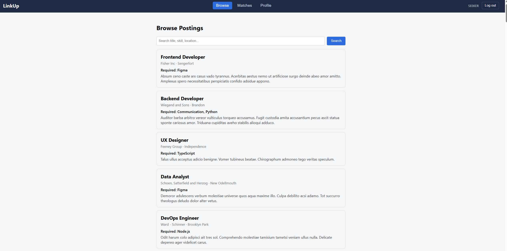

# LinkUp - Targeted Job Matching & Private Chat

## Author
- Tony Zhang
- Thomas Howes

## Class Link
https://johnguerra.co/classes/webDevelopment_online_summer_2026/

## Project Objective
LinkUp is a targeted matching app for jobseekers and employers. Instead of open
browsing, both sides commit to a small number of specific, evidenced
qualifications up front. A jobseeker posts one desired job title (must match)
plus their top 3 skills, each backed by a short piece of evidence. An employer
posts a job with the same title and only 1-2 top required skills. When a
seeker's title and skills line up with a posting, LinkUp surfaces it as a
match and unlocks a private chat between the two.

## Screenshot


## Tech Stack
- Frontend: React (hooks, client-side rendering), Create React App
- Backend: Node.js + Express
- Database: MongoDB (native Node.js driver, no Mongoose)
- Auth: Passport (local strategy) + express-session
- Data requests: Fetch API

## Folder Structure
```
linkup/
  backend/     Express API, Mongo connection, Passport auth, routes, seed script
  frontend/    React app (CRA, hooks, one component per file + matching CSS)
```

## Instructions to Build

### 0. Prerequisites - MongoDB on `localhost:27017`
The backend needs a running MongoDB. Pick one:

- **Docker (recommended):**
  ```bash
  docker run -d --name linkup-mongo -p 27017:27017 -v linkup-mongo-data:/data/db mongo:7
  ```
  Later just `docker start linkup-mongo` / `docker stop linkup-mongo`.
- **Native install:** MongoDB Community Server (installs as a service on 27017).
- **Cloud:** a free MongoDB Atlas cluster - use its `mongodb+srv://...` string as
  `MONGO_URI` instead of the local one.

### 1. Backend
```bash
cd backend
npm install
cp .env.example .env   # defaults work for local Mongo; set a long random SESSION_SECRET
npm run seed            # populates 5k+ synthetic records
npm run dev              # starts API on http://localhost:5000
```

### 2. Frontend
```bash
cd frontend
npm install
npm start                # starts CRA dev server on http://localhost:3000
```

In development the CRA dev server proxies `/api` requests to the backend on
`http://localhost:5000` (see the `proxy` field in `frontend/package.json`), so
open the app at http://localhost:3000. Every seeded user's password is
`password123`, or register a fresh account.

## Environment Variables
See `backend/.env.example`. Never commit a real `.env` file - it is already
listed in `.gitignore`.

## Deployment
Deployed as a **single service**: in production Express serves the built React
app from the same origin (see `server.js`), so there is no cross-origin cookie
or CORS setup to manage. Hosted on Render with MongoDB Atlas.

**Live URL:** https://linkup-b91k.onrender.com/

### Steps
1. **Database - MongoDB Atlas:** create a free M0 cluster, add a DB user, and
   allow access from anywhere (`0.0.0.0/0`). Copy the `mongodb+srv://...` URI.
2. **Seed the cloud DB** (once): set `MONGO_URI` to the Atlas URI in your local
   `backend/.env`, run `npm run seed`, then switch `.env` back for local dev.
3. **Render web service:** New + > Web Service, connect this repo, and set:
   - **Build Command:**
     `cd frontend && npm install && npm run build && cd ../backend && npm install`
   - **Start Command:** `cd backend && npm start`
   - **Environment variables:**
     - `NODE_ENV=production`
     - `MONGO_URI=<your Atlas URI>`
     - `MONGO_DB_NAME=linkup`
     - `SESSION_SECRET=<a long random string>`

   (`PORT` is provided by Render automatically; secure session cookies work via
   `trust proxy`.)

## AI Usage Disclosure
AI tools were used for brainstorming, scaffolding boilerplate, debugging help,
and writing support. Both students implemented, understood, and are able to
explain the full-stack logic for their own user stories.

## License
MIT - see `LICENSE`.
