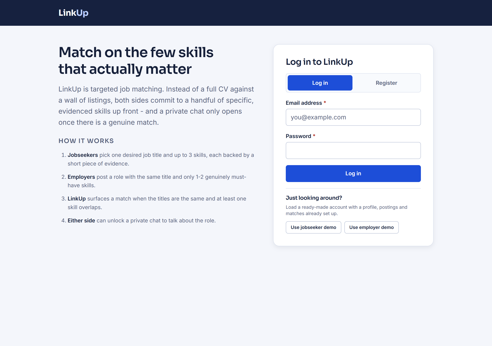
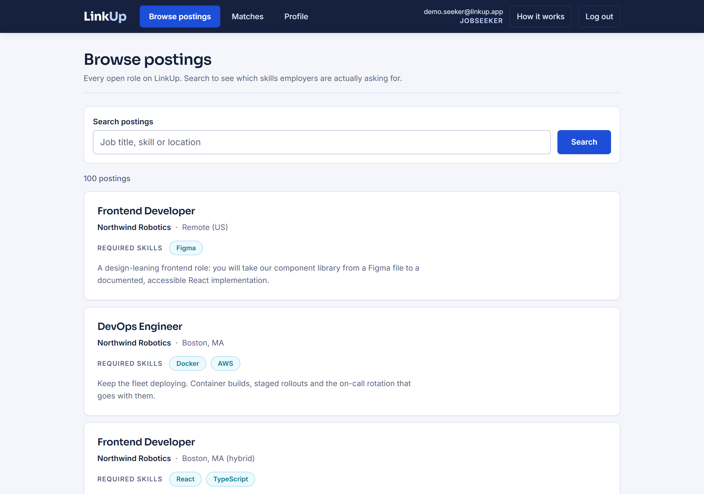
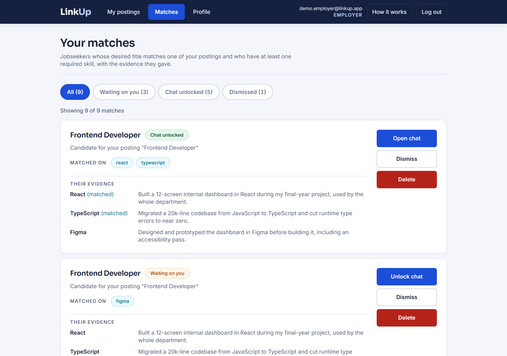
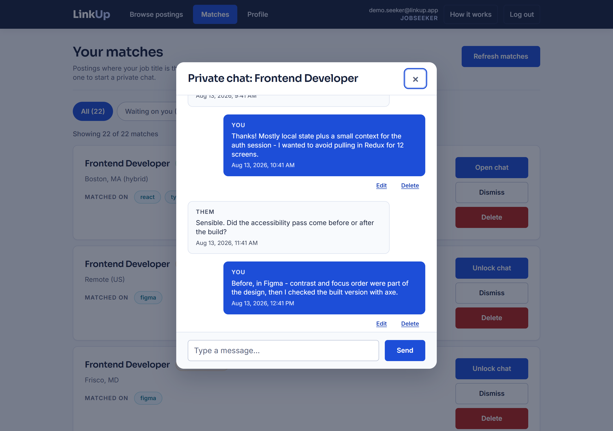
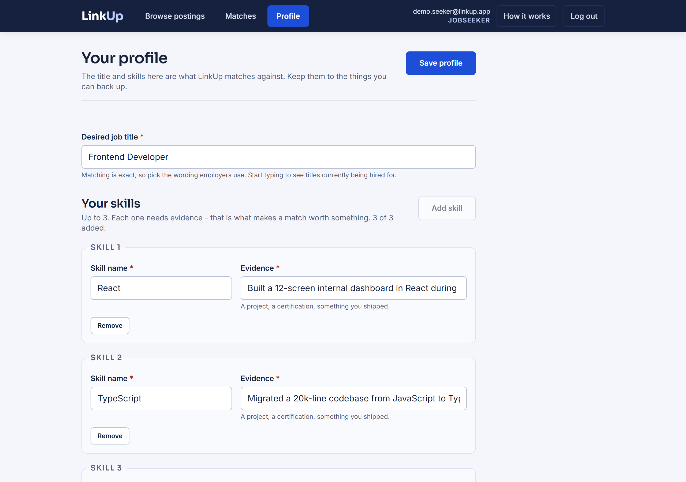
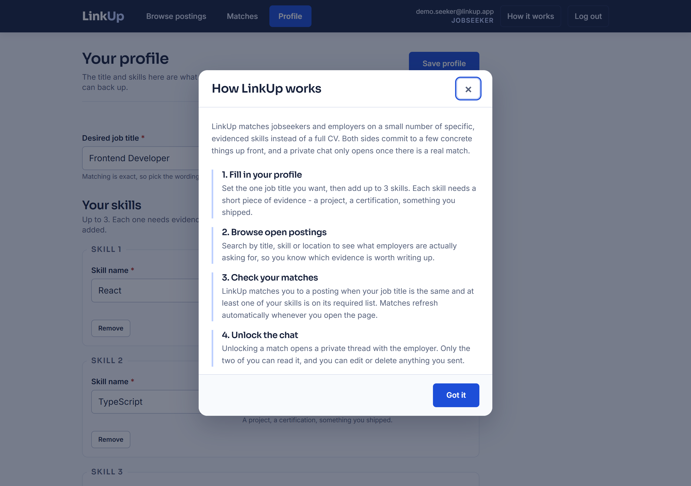
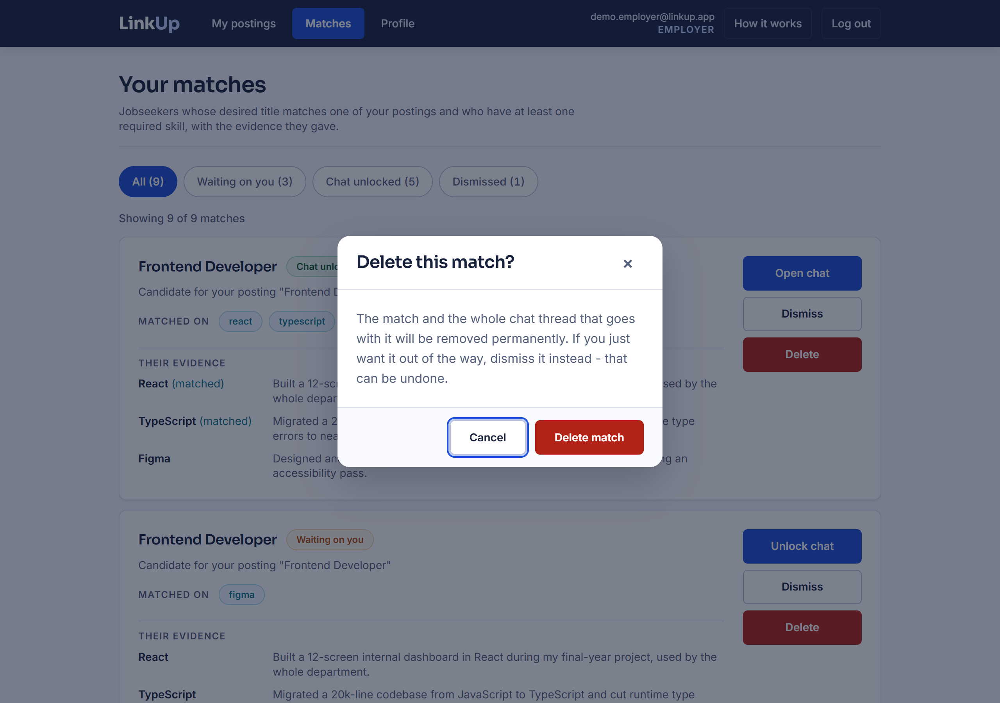
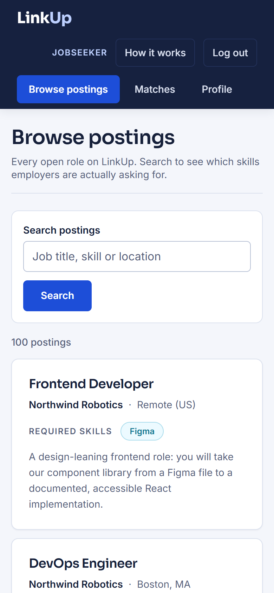

# LinkUp — Targeted Job Matching & Private Chat

Match on a few specific, **evidenced** skills instead of a full CV — and open a
private chat only once there is a genuine match.



---

## Author

**Thomas Howes** — this iteration (design, accessibility and usability), solo.

The original LinkUp build was a two-person project with **Tony Zhang**, who
co-authored the round-1 backend and frontend.

## Class Link

[CS5610 Web Development — Summer 2026](https://johnguerra.co/classes/webDevelopment_online_summer_2026/)

## Links

| What           | Where                               |
| -------------- | ----------------------------------- |
| **Live app**   | https://linkup-bse3.onrender.com/   |
| **Demo video** | _add the public video URL here_     |
| **Slides**     | _add the slides URL here_           |
| **Repository** | https://github.com/tom-howes/LinkUp |

**Demo accounts** (password `password123` for both) — also loadable with one
click from the landing page:

| Role      | Email                      |
| --------- | -------------------------- |
| Jobseeker | `demo.seeker@linkup.app`   |
| Employer  | `demo.employer@linkup.app` |

---

## Project Objective

Traditional job boards make jobseekers compete on a whole résumé and make
employers wade through hundreds of loosely-relevant applications. Both sides
spend most of their effort filtering noise.

**LinkUp inverts that: both sides commit to a few specific, evidenced
qualifications up front.**

- A **jobseeker** sets **one desired job title** plus up to **3 skills**, each
  backed by a short piece of evidence — a project, a certification, something
  they shipped.
- An **employer** posts a role with a job title and only **1–2 genuinely
  must-have skills**.
- LinkUp surfaces a **match** when the titles are the same **and** at least one
  skill overlaps.
- Either side can then **unlock a private chat** to talk about the role.

Because a posting is built around a couple of concrete required skills rather
than a generic description, jobseekers also get a much clearer picture of what a
role actually involves — and which of their evidence is worth writing up.

---

## Screenshots

| Browse postings (jobseeker)     | Matches with evidence (employer)                    |
| ------------------------------- | --------------------------------------------------- |
|  |  |

| Private chat                | Profile with evidenced skills     |
| --------------------------- | --------------------------------- |
|  |  |

| In-app instructions               | Destructive actions are confirmed               |
| --------------------------------- | ----------------------------------------------- |
|  |  |



---

## Tech Stack

- **Frontend:** React 19 (hooks, client-side rendering) via Create React App,
  **CSS Modules**, PropTypes on every component
- **Backend:** Node.js + Express
- **Database:** MongoDB (native Node.js driver — no Mongoose)
- **Auth:** Passport (local strategy) + express-session, sessions persisted in
  MongoDB via `connect-mongo`
- **Data requests:** Fetch API

Deliberately avoids Mongoose, Axios and the `cors` package.

---

## Folder Structure

```
LinkUp/
├── backend/
│   ├── config/          db connection, passport strategy, auth middleware
│   ├── routes/          auth, users, postings, matches, messages
│   ├── seed.js          synthetic data + demo accounts + indexes
│   └── server.js        Express app; serves the React build in production
├── frontend/
│   ├── public/
│   └── src/
│       ├── api/         one fetch wrapper for the whole API
│       ├── components/  one component per file + its own .module.css
│       ├── styles/      tokens.css (design tokens) + global.css (base layer)
│       └── utils/       focus management helpers
├── docs/
│   └── usability-study.md  study protocol + report
├── images/              screenshots and wireframes
├── design.md            personas, user stories, wireframes, design system
└── render.yaml          deployment blueprint
```

---

## Design

The full rationale is in [`design.md`](design.md). In short:

### Typography

Two families, both non-default, loaded from Google Fonts with `preconnect` and
`display=swap`:

- **Sora** (600/700) — headings and the brand. Geometric, slightly technical.
- **Inter** (400/500/600) — body and UI. Humanist, built for screen text.

Sizes follow a **1.2 (minor third) modular scale** from a 16px base, exposed as
`--fs-xs` … `--fs-2xl`.

### Colour

One semantic palette, defined once in `frontend/src/styles/tokens.css` and used
everywhere. The action colours are **consistent across every screen**:

| Meaning                               | Colour                   | Used for                                 |
| ------------------------------------- | ------------------------ | ---------------------------------------- |
| **Approve / primary**                 | Brand blue `#1d4ed8`     | Save, Publish, Send, Log in, Unlock chat |
| **Cancel / secondary**                | Neutral outline on white | Cancel, Dismiss, Clear, Back             |
| **Destroy**                           | Red `#b42318`            | Delete — always behind a confirmation    |
| **Positive status** (never an action) | Green `#15803d`          | "Saved", "Chat unlocked", "Open"         |
| **Needs attention**                   | Amber `#b54708`          | "Waiting on you"                         |
| **Informational highlight**           | Teal `#0e7490`           | Matched skills                           |

Navy (`#16213f`) carries the app chrome. Every pair clears WCAG AA — the lowest
ratio in the app is 5.02:1 (matched-skill teal on its tint).

### Layout

A **4px spacing grid** (`--space-1` … `--space-9`) drives every margin, padding
and gap, so the vertical rhythm lines up. Each screen opens with the same
`PageHeader`: `<h1>` top-left where the eye lands first, a one-line explanation
under it, and that screen's single most important action opposite — the only
large blue button above the fold.

---

## Accessibility

Target: WCAG 2.1 AA.

- **0 axe-core violations** (axe-core 4.10.2) across 11 screens and overlays —
  every view in both roles, plus the chat and confirmation dialogs, at desktop
  and mobile widths.
- **Fully keyboard operable** — skip link, visible `:focus-visible` ring, DOM
  tab order, no positive `tabindex`, real `<form>`s so <kbd>Enter</kbd> submits.
- **Native `<dialog>` modals** for the chat and every confirmation: real focus
  trap, <kbd>Esc</kbd> to close, focus returned to the trigger.
- **Semantic HTML** — one `<h1>` per screen with no skipped levels, landmark
  regions, `<article>` cards, `<ul>` lists, `<time>` timestamps, `<fieldset>`
  groups. Every control is a real `<button>`, `<input>` or `<select>`; there are
  no `div` buttons anywhere.
- **Never colour alone** — every status is also spelled out in words.
- **Live regions** — errors are `role="alert"`, confirmations and result counts
  are `role="status"`.
- Honours `prefers-reduced-motion`.

To re-run the audit, open the app and paste this into the browser console:

```js
const s = document.createElement("script");
s.src = "https://cdnjs.cloudflare.com/ajax/libs/axe-core/4.10.2/axe.min.js";
s.onload = async () => console.table((await axe.run(document)).violations);
document.head.appendChild(s);
```

**Two justified exceptions**, in case a report flags them:

1. _Tap-target size on the footer link._ "Source on GitHub" is 17px tall, but it
   is an inline link inside a sentence — explicitly exempted by WCAG 2.5.8 under
   the inline exception. Every actual control is at least 44px on its smallest
   axis.
2. _Lighthouse performance._ Run it against the production build
   (`npm run build`), not the CRA dev server — the dev bundle is unminified and
   ships the HMR client, which scores badly for reasons that do not exist in the
   deployed app.

---

## Instructions to Build

### Prerequisites

- Node.js 18+
- A MongoDB instance. Either:
  - **Docker:** `docker run -d --name linkup-mongo -p 27017:27017 -v linkup-mongo-data:/data/db mongo:7`
  - **Native:** MongoDB Community Server (runs on `localhost:27017`)
  - **Cloud:** a free MongoDB Atlas cluster — use its `mongodb+srv://…` string
    as `MONGO_URI`

### 1. Install

```bash
git clone https://github.com/tom-howes/LinkUp.git
cd LinkUp
npm run install:all
```

### 2. Configure

```bash
cp backend/.env.example backend/.env
```

The defaults work against local MongoDB. Set `SESSION_SECRET` to a long random
string. **Never commit `backend/.env`** — it is already in `.gitignore`.

### 3. Seed the database

```bash
npm run seed
```

Creates ~4,400 synthetic documents (700 users, 400+ postings, 1,500+ matches,
1,700+ messages), the two demo accounts, and the indexes.

### 4. Run it

In two terminals:

```bash
npm run dev:backend
```

```bash
npm run dev:frontend
```

Open **http://localhost:3000**. The CRA dev server proxies `/api` to the backend
on port 5000 (see the `proxy` field in `frontend/package.json`).

Every seeded account's password is `password123`, or register a fresh one.

### Other scripts

| Command                | What it does                                |
| ---------------------- | ------------------------------------------- |
| `npm run lint`         | ESLint over backend and frontend (0 errors) |
| `npm run format`       | Prettier over the whole repo                |
| `npm run format:check` | Verify formatting without writing           |
| `npm run build`        | Production build of the React app           |
| `npm start`            | Start the Express server (serves the build) |

---

## Environment Variables

See [`backend/.env.example`](backend/.env.example).

| Variable         | Purpose                                       |
| ---------------- | --------------------------------------------- |
| `PORT`           | API port (default 5000)                       |
| `MONGO_URI`      | MongoDB connection string                     |
| `MONGO_DB_NAME`  | Database name (`linkup`)                      |
| `SESSION_SECRET` | Session signing secret — long and random      |
| `CLIENT_ORIGIN`  | Allowed origin in split-deployment dev setups |

No credentials are committed to this repository. `.env` is gitignored, and the
deployment blueprint marks `MONGO_URI` as `sync: false` so it is entered in the
hosting dashboard only.

---

## Deployment

**Live URL:** https://linkup-bse3.onrender.com/

Deployed as a **single service**: in production Express serves the built React
app from the same origin as the API (see `backend/server.js`), so there is no
cross-origin cookie or CORS setup to manage. Sessions live in MongoDB, so the
free tier's idle-sleep does not log everyone out mid-task.

### Steps (Render + MongoDB Atlas)

1. **Atlas:** create a free M0 cluster, add a database user, allow access from
   anywhere (`0.0.0.0/0`), and copy the `mongodb+srv://…` URI.
2. **Seed the cloud database once:** point `MONGO_URI` in your local
   `backend/.env` at Atlas, run `npm run seed`, then switch it back.
3. **Render:** New ➜ Blueprint, point it at this repo. `render.yaml` sets the
   build and start commands and the health check; enter `MONGO_URI` when
   prompted. `SESSION_SECRET` is generated for you and `PORT` is injected.

   To do it without the blueprint, create a Web Service with:
   - **Build:** `npm run install:all && npm run build`
   - **Start:** `npm start`
   - **Env:** `NODE_ENV=production`, `MONGO_URI`, `MONGO_DB_NAME=linkup`,
     `SESSION_SECRET`

---

## Data Model

Four MongoDB collections (native driver), all supporting full CRUD:

| Collection | Key fields                                                                                                                      |
| ---------- | ------------------------------------------------------------------------------------------------------------------------------- |
| `users`    | `email`, `password` (bcrypt), `role`; seekers add `desiredTitle` + `skills[{name, evidence}]` (≤3); employers add `companyName` |
| `postings` | `title`, `requiredSkills[]` (1–2), `description`, `location`, `posterId`, `status` (`open`\|`closed`)                           |
| `matches`  | `seekerId`, `postingId`, `posterId`, `matchedSkills[]`, `status` (`pending`\|`unlocked`\|`dismissed`)                           |
| `messages` | `matchId`, `senderId`, `text`, `timestamp`, `editedAt`                                                                          |

**Matching rule:** a match exists when
`normalize(seeker.desiredTitle) === normalize(posting.title)` **and** the
seeker's skills overlap the posting's `requiredSkills` by at least one. Deleting
a posting, match or account cascades to the dependent matches and messages.

---

## Usability Study

Protocol, tasks, measures and the report template are in
[`docs/usability-study.md`](docs/usability-study.md). **The study has not been
run yet** — sections 6–8 are waiting on 3 participant sessions (3 per project
member; this iteration has one member).

Section 9 is a separate **heuristic evaluation**: an expert inspection of the
round-1 build against Nielsen's heuristics and WCAG 2.1 AA, which is what drove
this iteration. It records design reasoning, not observed user behaviour.

---

## AI Usage Disclosure

AI tools were used for brainstorming, scaffolding boilerplate, debugging help,
and writing support, including on this design and accessibility iteration. I
implemented, understand, and can explain the full-stack logic in this
repository, including the parts co-authored with Tony Zhang in round 1.

---

## License

MIT — see [`LICENSE`](LICENSE).
