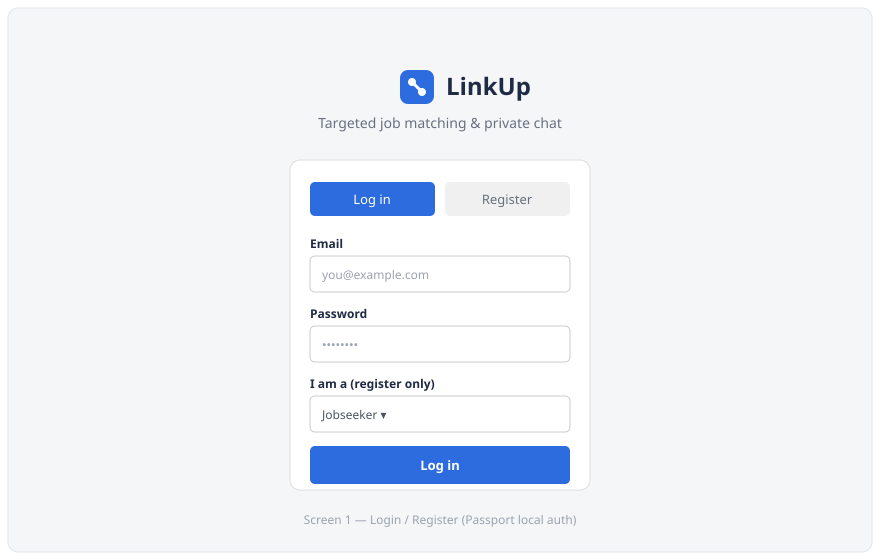
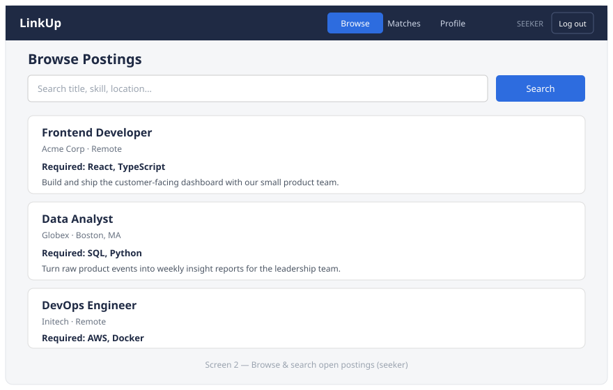
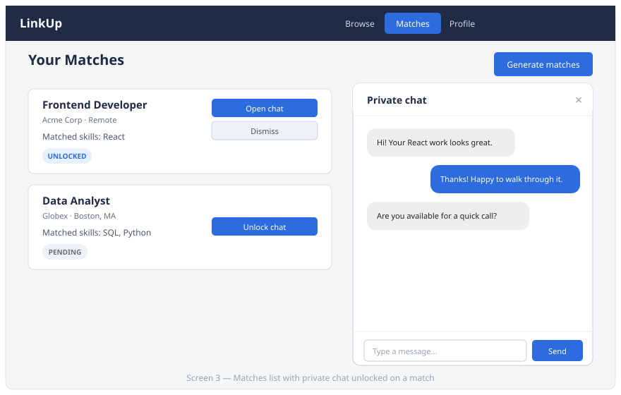
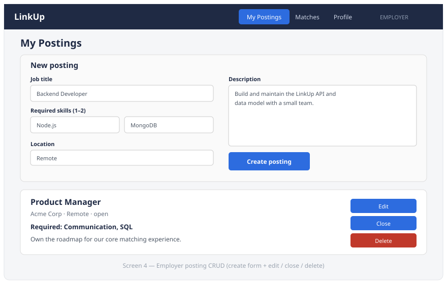
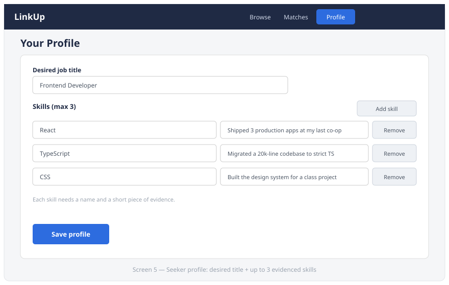

# LinkUp — Design Document

**Targeted Job Matching & Private Chat**

- **Authors:** Tony Zhang, Thomas Howes
- **Class:** [Web Development, Summer 2026](https://johnguerra.co/classes/webDevelopment_online_summer_2026/)
- **Repository:** github.com/tom-howes/LinkUp

---

## 1. Project Description

Traditional job boards ask jobseekers to compete on a full résumé and ask
employers to wade through hundreds of loosely-relevant applications. Both sides
spend most of their effort filtering noise.

**LinkUp flips the model: both sides commit to a few specific, evidenced
qualifications up front.** A jobseeker posts **one desired job title** plus their
**top 3 skills**, each backed by a short piece of evidence (a project, a
certification, a shipped feature). An employer posts a job with the **same kind
of title** and only **1–2 must-have skills**. When a seeker's title and at least
one skill line up with a posting, LinkUp surfaces it as a **match** and lets
either side **unlock a private chat** to talk about the role.

Because postings are built around a couple of concrete required skills rather
than a generic description, LinkUp also gives seekers a clearer picture of what
a role actually involves day-to-day — helping connect coursework and self-study
to the skills employers are really screening for.

**What makes it different**

- Matching is driven by an exact **title match + skill overlap**, not keyword
  search or a résumé upload.
- Every seeker skill carries **evidence**, so a match is a claim someone can back
  up — not just a box ticked.
- Conversations are **gated behind a real match** and unlocked deliberately, so
  chat only happens between genuinely relevant people.

---

## 2. User Personas

### Priya — Recent Graduate

- **Age / context:** 22, just finished a CS degree, limited formal work history.
- **Goal:** Get noticed for one or two things she is genuinely strong at (React,
  TypeScript) instead of being screened out for a thin résumé.
- **Frustration:** On big job boards her application disappears into a pile; she
  never learns whether her skills were even relevant.
- **How LinkUp helps:** She sets _Frontend Developer_ + three evidenced skills.
  LinkUp surfaces only the postings she actually qualifies for, and an employer
  can start a focused conversation about her React work.

### Marcus — Hiring Manager

- **Age / context:** 38, engineering manager at a small company, hiring while
  also shipping product.
- **Goal:** Skip irrelevant applicants and only talk to people who have the 1–2
  must-have skills for the role.
- **Frustration:** Reviewing dozens of résumés for a role that really comes down
  to "can they do X and Y."
- **How LinkUp helps:** He posts _Backend Developer_ requiring **Node.js** and
  **MongoDB**. Only seekers whose title and skills overlap become matches, and he
  can open a private chat with the strong ones.

### Dana — Career Switcher

- **Age / context:** 30, moving from marketing into data analysis via
  self-study.
- **Goal:** Find out whether her evidence for a new skill is strong enough to
  compete in an unfamiliar field.
- **Frustration:** She doesn't know which skills employers actually screen for,
  or whether her portfolio projects "count."
- **How LinkUp helps:** Postings expose the concrete required skills for a title,
  so Dana can see exactly what _Data Analyst_ roles ask for (SQL, Python), phrase
  her evidence against them, and get real feedback in chat.

---

## 3. User Stories

Written as stories (who / want / so that), each with acceptance criteria.

1. **Seeker — build an evidenced profile**
   _As a jobseeker, I want to set my desired title and up to 3 skills with
   evidence, so that I only surface for postings I'm genuinely qualified for._
   - Can set exactly one desired title.
   - Can add up to 3 skills; each requires a name **and** a short evidence note.
   - Saving persists to my profile and is reflected immediately.

2. **Employer — manage postings (full CRUD)**
   _As an employer, I want to create, edit, delete, and browse my own postings
   with a title and 1–2 required skills, so that I attract closely matching
   candidates._
   - Can create a posting with a title, 1–2 required skills, location, and
     description.
   - Can edit, close/reopen, and delete only my own postings.
   - The create form rejects 0 skills or more than 2.

3. **Anyone — automatic matching**
   _As a user, I want the system to surface matches when my title and skills
   align with a posting, so that I don't have to search manually._
   - A match is generated when a seeker's title equals a posting's title **and**
     at least one required skill overlaps.
   - Matches record which skills matched.
   - Re-running matching does not create duplicates.

4. **Matched user — private chat**
   _As a matched user, I want to open a private chat once a match is unlocked, so
   that we can discuss the broader role and skillset._
   - Chat is only available on an **unlocked** match.
   - Only the two participants can read or post messages.
   - I can send, edit, and delete my own messages.

5. **Anyone — manage matches**
   _As a user, I want to view and manage my matches (pending / unlocked /
   dismissed), so that I can track who I'm talking to._
   - I can see all my matches with their current status.
   - I can unlock, dismiss, or delete a match.
   - Deleting a match also removes its chat history.

---

## 4. Design Mockups

Low-fidelity wireframes of the primary screens, drawn before the first build.
The shipped UI follows this structure; the colours and type were revised in the
design iteration documented in §7.

### 4.1 Login / Register

Email + password with a role selector on register (Passport local strategy).

### 4.2 Browse Postings (seeker)

A search box over the open postings, each card showing title, company, required
skills, and a short description.

### 4.3 Matches & Private Chat (seeker)

Match cards with status badges and actions. Unlocking a match opens the private
chat overlay with message bubbles and a composer.

### 4.4 Employer Postings (create + manage)

The create form (title, 1–2 skills, location, description) above the employer's
existing postings, each with edit / close / delete controls.

### 4.5 Seeker Profile

Desired title plus up to three skills, each paired with an evidence note.

---

## 5. Data Model (reference)

Four MongoDB collections (native driver, no Mongoose):

| Collection | Key fields                                                                                                                                             |
| ---------- | ------------------------------------------------------------------------------------------------------------------------------------------------------ |
| `users`    | `email`, `password` (bcrypt), `role` (`seeker`\|`employer`); seekers add `desiredTitle` + `skills[{name, evidence}]` (≤3); employers add `companyName` |
| `postings` | `title`, `requiredSkills[]` (1–2), `description`, `location`, `posterId`, `status` (`open`\|`closed`)                                                  |
| `matches`  | `seekerId`, `postingId`, `posterId`, `matchedSkills[]`, `status` (`pending`\|`unlocked`\|`dismissed`)                                                  |
| `messages` | `matchId`, `senderId`, `text`, `timestamp`                                                                                                             |

**Matching rule:** a match exists when `normalize(seeker.desiredTitle) ===
normalize(posting.title)` **and** the seeker's skills overlap the posting's
`requiredSkills` by at least one. Deleting a posting or match cascades to the
dependent matches / messages.

---

## 6. Tech Stack

- **Frontend:** React (hooks, client-side rendering) via Create React App, with
  CSS Modules and PropTypes on every component
- **Backend:** Node.js + Express
- **Database:** MongoDB (native Node.js driver)
- **Auth:** Passport (local strategy) + express-session, sessions persisted in
  MongoDB via `connect-mongo`
- **Data requests:** Fetch API
- Deliberately avoids Mongoose, Axios, and the `cors` package.

---

## 7. Design System

Everything below lives in `frontend/src/styles/tokens.css` as CSS custom
properties. No component hard-codes a colour, size or spacing value, which is
what keeps the app visually consistent as it grows.

### 7.1 Typography

A two-family pairing, neither of them a browser default:

| Role                      | Family    | Weights       | Why                                                                                                       |
| ------------------------- | --------- | ------------- | --------------------------------------------------------------------------------------------------------- |
| Display — headings, brand | **Sora**  | 600, 700      | Geometric and slightly technical; gives headings a distinct voice and reads as "product", not "document". |
| Body — UI, prose          | **Inter** | 400, 500, 600 | A humanist sans designed specifically for screen UI: tall x-height, unambiguous `I`/`l`/`1`.              |

They pair because both are neutral grotesques with matching x-heights, so they
sit on the same baseline rhythm — but Sora's tighter, more geometric letterforms
at `-0.02em` tracking read as a different level of the hierarchy at a glance.

Sizes are a **1.2 (minor third) modular scale** from a 16px base:

| Token       | Size          | Used for                     |
| ----------- | ------------- | ---------------------------- |
| `--fs-xs`   | 0.75rem (12)  | overlines, badges, hints     |
| `--fs-sm`   | 0.875rem (14) | meta text, buttons, body-sm  |
| `--fs-base` | 1rem (16)     | body                         |
| `--fs-md`   | 1.125rem (18) | lead paragraphs, card titles |
| `--fs-lg`   | 1.375rem (22) | section titles               |
| `--fs-xl`   | 1.75rem (28)  | page titles (`<h1>`)         |
| `--fs-2xl`  | 2.25rem (36)  | landing-page hero            |

Line heights: `1.2` tight (headings), `1.35` snug (dense UI), `1.6` normal
(prose). Prose is capped at `68ch` (`--measure`) for comfortable reading.

### 7.2 Colour

The palette is built around a navy/blue core — the register a hiring product
needs to be trusted in — with a teal accent so informational highlights don't
compete with the primary action.

The important part is that colour carries **one consistent meaning everywhere**:

| Semantic                  | Token             | Hex                          | Applied to                                         |
| ------------------------- | ----------------- | ---------------------------- | -------------------------------------------------- |
| Approve / primary action  | `--c-brand-600`   | `#1d4ed8`                    | Save, Publish, Send, Log in, Unlock chat           |
| Cancel / secondary action | neutral outline   | `#ffffff` + `#b9c2d6` border | Cancel, Dismiss, Clear, Back                       |
| Destructive action        | `--c-danger-600`  | `#b42318`                    | Delete only — always behind a confirmation         |
| Positive status           | `--c-success-700` | `#15803d`                    | "Saved", "Chat unlocked", "Open" — never an action |
| Needs attention           | `--c-warn-700`    | `#b54708`                    | "Waiting on you"                                   |
| Informational highlight   | `--c-accent-700`  | `#0e7490`                    | Matched skills                                     |
| App chrome                | `--c-navy-800`    | `#16213f`                    | Header                                             |

Two rules follow from this and are enforced by routing every action through the
shared `Button` component:

1. **There is exactly one blue button per screen region** — the primary action.
   Everything else is neutral or, if destructive, red.
2. **Green is a status colour, not an action colour.** In the previous build
   "Save profile" was green while "Create posting" was blue, so the same kind of
   action looked like two different things.

Every foreground/background pair clears WCAG AA. The lowest ratio in the app is
5.02:1 (matched-skill teal on its tint) against a 4.5:1 requirement; body text
on the canvas is 14.92:1, and white on both the primary and destructive buttons
is above 6.5:1.

### 7.3 Spacing and layout

A **4px grid**, `--space-1` (4px) through `--space-9` (64px). Every margin,
padding and gap in the app is one of these values — that is what makes edges
line up between a card, the search box above it and the page header above that.

Content sits in a `64rem` column centred in the viewport. Cards use a
`--radius-md` (10px) corner and a single subtle shadow (`--shadow-sm`), with
heavier elevation reserved for modals.

### 7.4 Visual hierarchy

Every screen is built from the same `PageHeader`, which puts the most important
things where the eye lands first — the top-left:

1. `<h1>` in Sora at `--fs-xl` — the largest, heaviest thing on the screen.
2. A one-line description directly under it in muted text.
3. The screen's single most important action opposite it on the right: the only
   large brand-blue button above the fold.
4. A horizontal rule, then the content, all sharing the `<h1>`'s left edge.

Within a card the same ordering applies: title first, then status badge, then
metadata, then matched skills, then evidence, with the actions in a fixed-width
column on the right so they align down the whole list.

### 7.5 Component inventory

| Component                                     | Responsibility                                                             |
| --------------------------------------------- | -------------------------------------------------------------------------- |
| `Button`                                      | The only button primitive; owns the approve/cancel/destroy colours         |
| `Field`                                       | Labelled control; wires up hint, error, `aria-describedby`, `aria-invalid` |
| `Badge`                                       | Status and skill chips; tone + always-worded label                         |
| `Modal`                                       | Native `<dialog>` wrapper: focus trap, Escape, focus return                |
| `ConfirmDialog`                               | Confirmation in front of every destructive action                          |
| `PageHeader`                                  | The hierarchy pattern above                                                |
| `EmptyState`                                  | Explains _why_ a list is empty and what to do next                         |
| `StatusMessage`                               | The one way errors and confirmations are announced                         |
| `HelpPanel`                                   | Role-specific in-app instructions + keyboard shortcuts                     |
| `Navbar`                                      | App chrome, landmark nav, `aria-current`                                   |
| `PostingCard` / `PostingList` / `PostingForm` | Postings CRUD                                                              |
| `MatchCard` / `MatchList`                     | Matches, filters, evidence display                                         |
| `SkillInput` / `ProfileEditor`                | Evidenced-skill profile editing                                            |
| `Chat`                                        | The private thread for an unlocked match                                   |
| `AuthForm`                                    | Signed-out landing page and authentication                                 |
